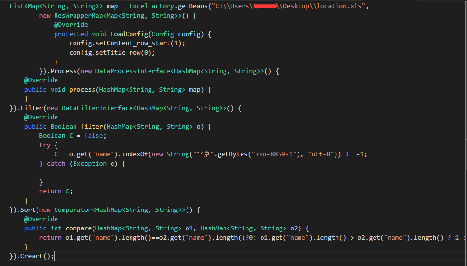
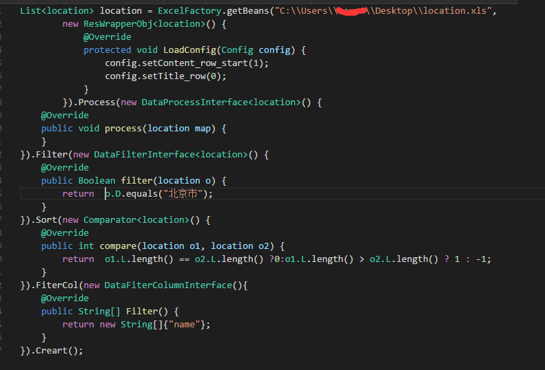

# ExcelReads(简单Excel通用读取器)
## ExcelReads是什么?
* 这是一个通用的简单的Excel读取器
* 支持自定义JavaBean实体读取和HashMap自动读取
* 支持自定义扩展
* 支持自定义Sheet范围，数据开始行数
* 支持正则过滤数据格式
* JavaBean实体支持使用注解添加正则规则校验，HashMap支持数组规则校验
* 依赖POI，使用Maven构建
## 更新纪录

### 更新2016/11/29
* 增加了简单类型得写入，生成xls/xlsx
* 直接JavaBean类型写入，注解命名
* 支持Map key-value类型写入
* 写入时支持和读取一样得过滤加工排序等写法

### 更新2016/11/29
* 增加CreateMap By Key
* 去除无用泛型
* 增加xlsx支持

### 更新2016/11/8
* 支持数据过滤和处理是转换，基于事件模式
* 更新为Build模式创建实例
* 增加数据过滤、数据转换和数据排序回调接口
* 采用链式set方式进行


## 其他
* 自定义读取支持出简单的规范化数据格式，即典型的表头格式
* 可以继承 WapperMap 和 WapperObj进行扩展
* 直接使用ExcelFactory.getBeans进行获取，WapperObj则自己添加泛型
* 注解Value对应列标题，Required对应正则，可自己写正则表达式或者直接使用RegHelper
* 实体bean数据要比hashMap慢，7w条数据慢800ms，加入正则减慢速度(测试中加入了正则)

## 使用方法说明
1. 本程序只能读取简单格式的xls文件，文件布局如下（标准的行列结构）：<br>

| 标题1 | 标题2 | 标题3 |
|:-----:|:-----:|:-----:|
|foo    | foo   | foo   |
|bar    | bar   | bar   |
|baz    | baz   | baz   |

## 写入例子
```java
List<A> aa = new ArrayList<>();
        aa.add(new A("a", "b"));
        aa.add(new A("aa", "bb"));
        ExcelFactory.saveExcel(aa, System.getProperty("user.dir").concat("\\Save.xlsx")
        ).Process((A a) -> a.setA("xxxxxxx")).FilterCol(() -> new String[]{"B"}).
                Filter((A a) -> a.getA().length() > 1).Save();
        List<Map> m = new ArrayList<>();
        Map mm = new HashMap();
        mm.put("A", "w");
        mm.put("A1", "w2");
        mm.put("A2", "w3");
        Map mmm = new HashMap();
        mmm.put("A", "23");
        mmm.put("A1", "w3asf2");
        mmm.put("A2", "w二3");
        m.add(mm);
        m.add(mmm);
        ExcelFactory.saveExcel(m, System.getProperty("user.dir").concat("\\SaveMap.xlsx")
        ).Save();
```
## 读取例子
```java
 List<Map<String,String>> data=ExcelFactory.getBeans(System.getProperty("user.dir").concat("\\测试.xls"),
                new ResWrapperMap() {
                    @Override//配置Excel属性
                    protected void LoadConfig(Config config) {
                        config.setContent_row_start(3);
                        config.setTitle_row(2);
                    }
                }).//这里能够处理每一行数据
                Process((HashMap<String, String> o) -> System.out.println(o + "\n")
                //这里能够处理时候过滤某一列
                ).FilterCol(() -> new String[]{}
                //这里能根据某一行的某一列的内容来取舍这行数据
        ).Filter((HashMap<String, String> o) -> o.get("创建人") != null && o.get("创建人").length() > 5
                //排序
        ).Sort((o1, o2) -> o1.hashCode()>o2.hashCode()?1:hashCode()==o2.hashCode()?0:-1).Create();

//使用 .CreateMap(key_v) 生成Map<Key,Map>类型数据

```
生成对应自定义类型的写法

```java
Map<String,Seven> map=new ResWrapperObj(Seven) {
                    @Override
                    protected void LoadConfig(Config config) {
                        config.setContent_row_start(3);
                        config.setTitle_row(2);
                    }
                }).
                Process((HashMap<String, String> o) -> {}
                ).FilterCol(() -> new String[]{}
        ).Filter((HashMap<String, String> o) -> o.get("创建人") != null &&
```
 ## 效果

## 实体类截图

## 继承关系

## 加载Map模式

## 加载Bean模式

## 写入效果


* 邮件(hacker.kill07@gmail.com)
* QQ: 985390927
* weibo: [@Alden_情绪控](http://weibo.com/Sweets07)
* Blog: [http://sweets.cf](http://sweets.cf)