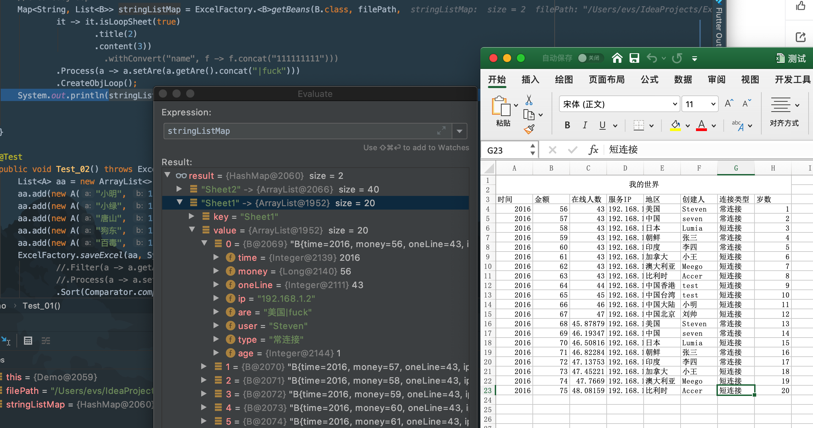

# ExcelReads(简单Excel通用读写器)


## ExcelReads是什么?
* 这是一个通用的简单的Excel读取器
* 支持自定义JavaBean实体读取和HashMap自动读取
* 支持自定义扩展
* 支持自定义Sheet范围，数据开始行数
* 支持数据库查询直接导出Excel(Map/Object)
* 支持正则过滤数据格式
* JavaBean实体支持使用注解添加正则规则校验，HashMap支持数组规则校验
* 依赖POI，使用Maven构建

在项目的pom文件增加下面内容,即可食用! Enjoy it!!!
```xml
<dependency>
  <groupId>com.github.matrixseven</groupId>
  <artifactId>ExcelReads</artifactId>
  <version>1.0.2</version>
</dependency>

```

## [更新日志详见:UpdateLogs.md](UPDATELOG.MD)
###最近三次更新:

#### 更新2019/4/26　(诈尸更新)
* 更加完善的类型推导，书写更方便(Great!!!)
* 修复增加过滤列无法读取数据bug
* 替换一些接口为Java８内置接口
* 更流畅优雅的调用方法
* 标注一些不建议使用的类/方法/属性

#### 更新2017/01/11
* 增加AnyCol来对应FilterCol方法，只保留AnyCol类列
* 增加SetCellStyle，突破CellStyle绑定wk约束，链式设置列单元格风格（非常狗血）

#### 更新2017/01/09
* 增加SetPath方法，随时切换保存路径
* 增加ConvertName方法，方便自定义Excel列名称
* 增加Flush方法，不在建议使用~~Save(@Deprecated)~~方法进行保存输出
* 增加SetOutputStream方法，可以放入自定义流，用于支持网页Response输出
* 处理一些小bug，完善异常提示信息

### 其他
* 自定义读取支持出简单的规范化数据格式，即典型的表头格式
* 可以继承 WapperMap 和 WapperObj进行扩展
* 直接使用ExcelFactory.getBeans进行获取，WapperObj则自己添加泛型
* 注解Value对应列标题，Required对应正则，可自己写正则表达式或者直接使用RegHelper
* 实体bean数据要比hashMap慢，7w条数据慢800ms，加入正则减慢速度(测试中加入了正则)

## 使用方法说明
1. 本程序只能读取简单格式的xls/xlsx文件，文件布局如下（标准的行列结构）：<br>

| 标题1 | 标题2 | 标题3 |
|:-----:|:-----:|:-----:|
|foo    | foo   | foo   |
|bar    | bar   | bar   |
|baz    | baz   | baz   |

### 读取Excel

* 喜大若奔（。・・）ノ　Filter/Sort等lambda操作不用在声明类型(~~还是要写一个泛型~~)
```java
//读取到Map类型
//使用 .CreateMap(key_v) 生成Map<Key,Map>类型数据
List<Map<String, String>> list = ExcelFactory.getBeans(filePath, WrapperFactory
    .MakeMap(it -> it.vocSize(1999).title(2).content(3)))
    .Filter(it -> !it.get("服务IP").contains("12"))
    .Process(it -> it.put("add", "这个是我增加的"))
    .FilterCol(df -> df.add("连接类型"))
    .CreateMap();

//读取到自定义JavaBean类型
List<A> create = ExcelFactory.getBeans(filePath2, WrapperFactory.<A>MakeObj(it -> it.vocSize(1999)
    .title(0).content(1), A.class))
    .Filter(it -> it.getA().equals(""))
    .FilterCol(it -> it.add("1"))
    .Sort(Comparator.comparing(A::getA))
    .Create();
```
## 数据库导出自定义Bean类型写法（xxx.Class类型）
```java
Result data=UNPOOLED_DATA_SOURCE.getConnection().prepareStatement("select * FROM  users_info limit 1000").executeQuery()
ExcelFactory.saveExcel(data,filePath,AS.class)
    .Filter(ｏ->o.getA().length() > 3)
    .Flush();
    
  //ConvertName 转行列名  
ExcelFactory.saveExcel(ps.executeQuery()).SetPath("seven.xlsx")
    .Process(it->it.put("address",it.get("address").concat("seven")))
    .SetCellStyle("A", cellStyle -> cellStyle
                            .setFillPattern(FillPatternType.DIAMONDS)
                            .setAlignment(HorizontalAlignment.RIGHT)
                            .setFillForegroundColor(HSSFColor.WHITE.index)
                            .setBottomBorderColor(HSSFColor.RED.index)
                            .setFillBackgroundColor(HSSFColor.GOLD.index)
                            .setRightBorderColor(HSSFColor.INDIGO.index))
    .ConvertName("address","地址")
    .ConvertName("name","姓名")
    .Flush();
```

 ## 效果

## 实体类截图

## 继承关系

## 引用关系

## 写入效果


* 邮件(hacker.kill07@gmail.com)
* QQ: 985390927
* weibo: [@Alden_情绪控](http://weibo.com/Sweets07)
* Blog: [http://blog.52python.cn](http://blog.52python.cn)